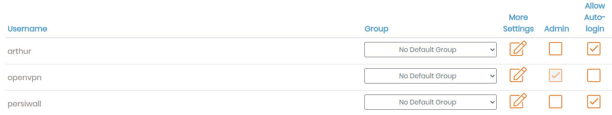
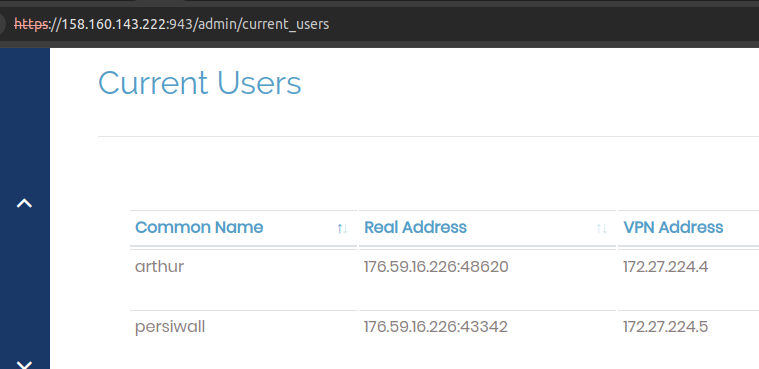
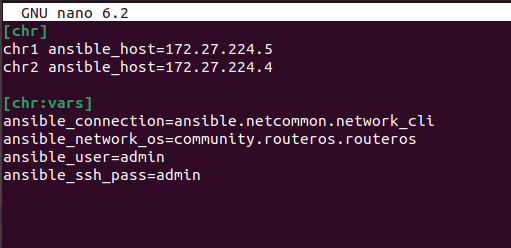
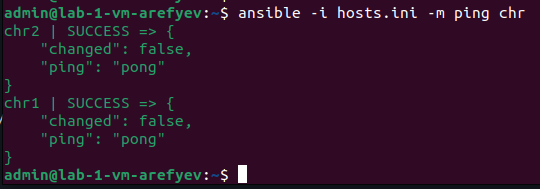
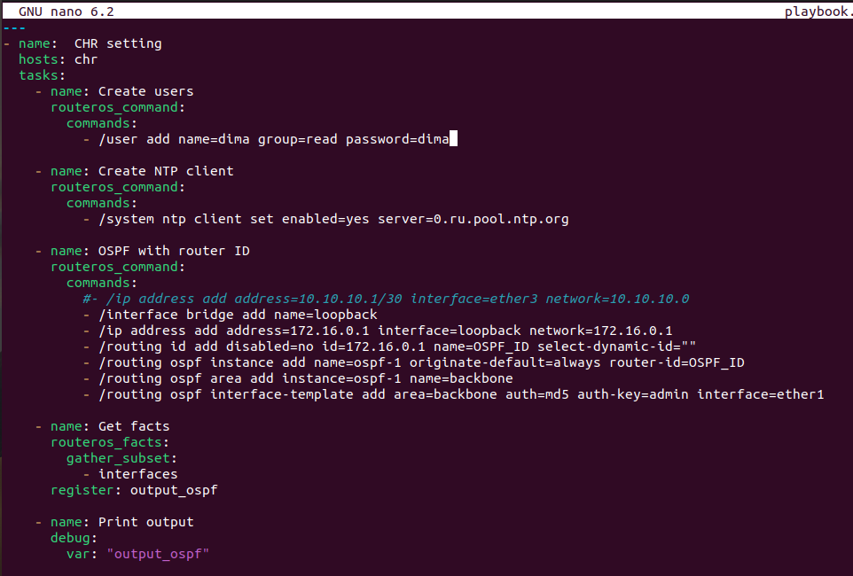
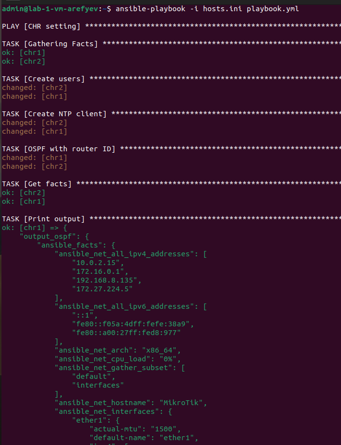
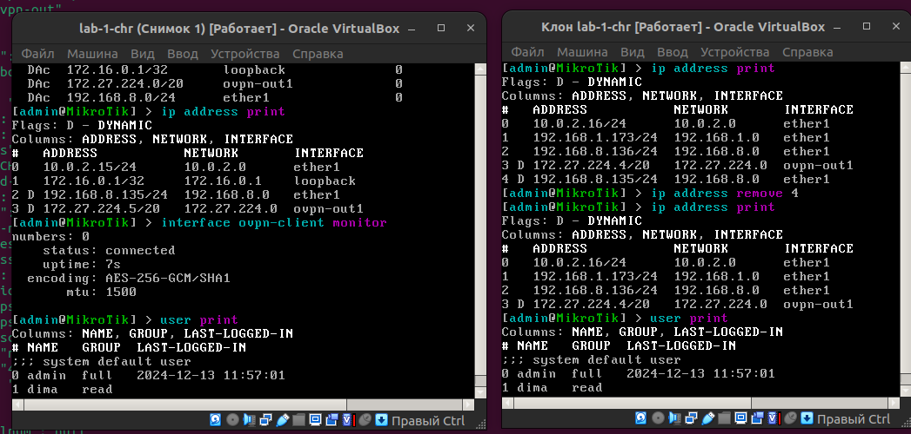
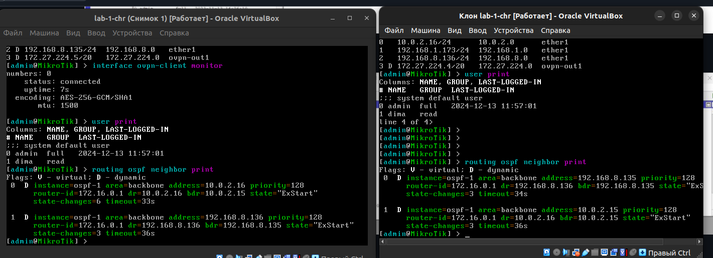
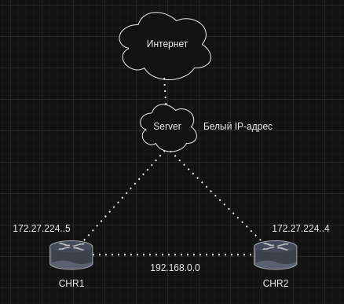

# Лабораторная работа №2 "Развертывание дополнительного CHR, первый сценарий Ansible"
---
University: [ITMO University](https://itmo.ru/ru/)

Faculty: [FICT](https://fict.itmo.ru)

Course: [Network programming](https://github.com/itmo-ict-faculty/network-programming)

Year: 2024/2025

Group: K34202

Author: Arefyev Dmitriy Vladimirovich

Lab: Lab2

Date of create: 30.09.2024

Date of finished: 13.12.2024

---

## Цель работы

С помощью Ansible настроить несколько сетевых устройств и собрать информацию о них. Правильно собрать файл Inventory.

## Ход работы

### Создание и подключение второго пользователя

В VirtualBox была создана копия первой виртуальной машины.

<p align="center">
  
</p>

В параметрах сети был также выбран сетевой мост. Далее в веб-клиенте OpenVPN Access Server был создан второй пользователь с именем Arthur

<p align="center">
  
</p>

Скаченный сертификат был загружен во вторую виртуальную машину. Командой ```ip address remove 0``` был удален адрес второй машины, потому что он повторял адрес первой, из-за чего обе не могли подключиться к серверу. Командой ```ip address add address=192.168.8.136/24 interface=ether1``` машине был выдан новый адрес. Теперь оба пользователя успешно подключились к серверу и получили адреса в сети VPN

<p align="center">
  
</p>

### Работа с Ansible

Был написан файл инвентаря hosts.ini и в нём указаны данные конфигурирования

<p align="center">
  
</p>

Файл инветаря сразу же был протестирован при помощи ping

<p align="center">
  
</p>

Далее был написан playbook

<p align="center">
  
</p>

Плейбук был запущен командой ```ansible-playbook -i hosts.ini playbook.yml```

<p align="center">
  
</p>

На самом деле всё прошло не так гладко, как показано на картинке. Сначала пришлось изменить правила ssh в ssh_config, чтобы можно было свободно подключаться к незнакомым устойствам без проверок безопасности. Так или иначе, всё сработало успешно. На машинах были созданы новые пользователи

<p align="center">
  
</p>

Проверим также OSPF на машинах

<p align="center">
  
</p>

### Схема связи

<p align="center">
  
</p>

### Полные конфигурации устройств:

Конфигурация CHR1:
```
ok: [chr1] => {
    "output_ospf": {
        "ansible_facts": {
            "ansible_net_all_ipv4_addresses": [
                "10.0.2.15",
                "172.16.0.1",
                "192.168.8.135",
                "172.27.224.5"
            ],
            "ansible_net_all_ipv6_addresses": [
                "::1",
                "fe80::f05a:4dff:fefe:38a9",
                "fe80::a00:27ff:fed8:977"
            ],
            "ansible_net_arch": "x86_64",
            "ansible_net_cpu_load": "0%",
            "ansible_net_gather_subset": [
                "default",
                "interfaces"
            ],
            "ansible_net_hostname": "MikroTik",
            "ansible_net_interfaces": {
                "ether1": {
                    "actual-mtu": "1500",
                    "default-name": "ether1",
                    "ipv4": [
                        {
                            "address": "10.0.2.15",
                            "subnet": "24"
                        },
                        {
                            "address": "192.168.8.135",
                            "subnet": "24"
                        }
                    ],
                    "ipv6": [
                        {
                            "address": "fe80::a00:27ff:fed8:977",
                            "subnet": "64"
                        }
                    ],
                    "last-link-up-time": "2024-12-13",
                    "link-downs": "0",
                    "mac-address": "08:00:27:D8:09:77",
                    "mtu": "1500",
                    "name": "ether1",
                    "type": "ether"
                },
                "lo": {
                    "actual-mtu": "65536",
                    "ipv6": [
                        {
                            "address": "::1",
                            "subnet": "128"
                        }
                    ],
                    "last-link-up-time": "2024-12-13",
                    "link-downs": "0",
                    "mac-address": "00:00:00:00:00:00",
                    "mtu": "65536",
                    "name": "lo",
                    "type": "loopback"
                },
                "loopback": {
                    "actual-mtu": "1500",
                    "ipv4": [
                        {
                            "address": "172.16.0.1",
                            "subnet": "32"
                        }
                    ],
                    "ipv6": [
                        {
                            "address": "fe80::f05a:4dff:fefe:38a9",
                            "subnet": "64"
                        }
                    ],
                    "l2mtu": "65535",
                    "last-link-up-time": "2024-12-13",
                    "link-downs": "0",
                    "mac-address": "F2:5A:4D:FE:38:A9",
                    "mtu": "auto",
                    "name": "loopback",
                    "type": "bridge"
                },
                "ovpn-out1": {
                    "actual-mtu": "1500",
                    "ipv4": [
                        {
                            "address": "172.27.224.5",
                            "subnet": "20"
                        }
                    ],
                    "last-link-up-time": "2024-12-13",
                    "link-downs": "0",
                    "mac-address": "02:01:DB:6E:99:09",
                    "mtu": "1500",
                    "name": "ovpn-out1",
                    "type": "ovpn-out"
                }
            },
            "ansible_net_model": null,
            "ansible_net_neighbors": [
                {
                    "address": "10.0.2.16",
                    "address4": "10.0.2.16",
                    "address6": "fe80::a00:27ff:fed8:977",
                    "age": "27s",
                    "board": "CHR",
                    "discovered-by": "cdp",
                    "identity": "MikroTik",
                    "interface": "ether1",
                    "interface-name": "ether1",
                    "ipv6": "yes",
                    "mac-address": "08:00:27:D8:09:77",
                    "platform": "MikroTik",
                    "software-id": "ff03QcPD",
                    "system-caps": "bridge",
                    "system-caps-enabled": "bridge",
                    "system-description": "MikroTik",
                    "unpack": "none",
                    "uptime": "1h7m2s",
                    "version": "7.15.3"
                }
            ],
            "ansible_net_serialnum": null,
            "ansible_net_uptime": "4m44s",
            "ansible_net_version": "7.15.3 (stable)"
        },
        "changed": false,
        "failed": false
    }
}
```

Конфигурация CHR2:
```
ok: [chr2] => {
    "output_ospf": {
        "ansible_facts": {
            "ansible_net_all_ipv4_addresses": [
                "10.0.2.16",
                "192.168.1.173",
                "192.168.8.136",
                "172.27.224.4",
                "172.16.0.1"
            ],
            "ansible_net_all_ipv6_addresses": [
                "::1",
                "fe80::a00:27ff:fed8:977",
                "fe80::2cdf:c9ff:fe45:fde"
            ],
            "ansible_net_arch": "x86_64",
            "ansible_net_cpu_load": "2%",
            "ansible_net_gather_subset": [
                "interfaces",
                "default"
            ],
            "ansible_net_hostname": "MikroTik",
            "ansible_net_interfaces": {
                "ether1": {
                    "actual-mtu": "1500",
                    "default-name": "ether1",
                    "ipv4": [
                        {
                            "address": "10.0.2.16",
                            "subnet": "24"
                        },
                        {
                            "address": "192.168.1.173",
                            "subnet": "24"
                        },
                        {
                            "address": "192.168.8.136",
                            "subnet": "24"
                        }
                    ],
                    "ipv6": [
                        {
                            "address": "fe80::a00:27ff:fed8:977",
                            "subnet": "64"
                        }
                    ],
                    "last-link-up-time": "2024-12-13",
                    "link-downs": "0",
                    "mac-address": "08:00:27:D8:09:77",
                    "mtu": "1500",
                    "name": "ether1",
                    "type": "ether"
                },
                "lo": {
                    "actual-mtu": "65536",
                    "ipv6": [
                        {
                            "address": "::1",
                            "subnet": "128"
                        }
                    ],
                    "last-link-up-time": "2024-12-13",
                    "link-downs": "0",
                    "mac-address": "00:00:00:00:00:00",
                    "mtu": "65536",
                    "name": "lo",
                    "type": "loopback"
                },
                "loopback": {
                    "actual-mtu": "1500",
                    "ipv4": [
                        {
                            "address": "172.16.0.1",
                            "subnet": "32"
                        }
                    ],
                    "ipv6": [
                        {
                            "address": "fe80::2cdf:c9ff:fe45:fde",
                            "subnet": "64"
                        }
                    ],
                    "l2mtu": "65535",
                    "last-link-up-time": "2024-12-13",
                    "link-downs": "0",
                    "mac-address": "2E:DF:C9:45:0F:DE",
                    "mtu": "auto",
                    "name": "loopback",
                    "type": "bridge"
                },
                "ovpn-out1": {
                    "actual-mtu": "1500",
                    "ipv4": [
                        {
                            "address": "172.27.224.4",
                            "subnet": "20"
                        }
                    ],
                    "last-link-down-time": "2024-12-13",
                    "last-link-up-time": "2024-12-13",
                    "link-downs": "1",
                    "mac-address": "02:01:DB:6E:99:09",
                    "mtu": "1500",
                    "name": "ovpn-out1",
                    "type": "ovpn-out"
                }
            },
            "ansible_net_model": null,
            "ansible_net_neighbors": [
                {
                    "address": "10.0.2.15",
                    "address4": "10.0.2.15",
                    "address6": "fe80::a00:27ff:fed8:977",
                    "age": "42s",
                    "board": "CHR",
                    "discovered-by": "cdp",
                    "identity": "MikroTik",
                    "interface": "ether1",
                    "interface-name": "ether1",
                    "ipv6": "yes",
                    "mac-address": "08:00:27:D8:09:77",
                    "platform": "MikroTik",
                    "software-id": "xTovrp/HybC",
                    "system-caps": "bridge",
                    "system-caps-enabled": "bridge",
                    "system-description": "MikroTik",
                    "unpack": "none",
                    "uptime": "4m2s",
                    "version": "7.15.3"
                }
            ],
            "ansible_net_serialnum": null,
            "ansible_net_uptime": "1h7m29s",
            "ansible_net_version": "7.15.3 (stable)"
        },
        "changed": false,
        "failed": false
    }
}
```
