# Лабораторная работа №3 "Развертывание Netbox, сеть связи как источник правды в системе технического учета Netbox"
---
University: [ITMO University](https://itmo.ru/ru/)

Faculty: [FICT](https://fict.itmo.ru)

Course: [Network programming](https://github.com/itmo-ict-faculty/network-programming)

Year: 2024/2025

Group: K34202

Author: Arefyev Dmitriy Vladimirovich

Lab: Lab3

Date of create: 30.09.2024

Date of finished: 24.12.2024

---

## Цель работы

С помощью Ansible и Netbox собрать всю возможную информацию об устройствах и сохранить их в отдельном файле.

## Ход работы

### Установка NetBox

NetBox было решено установить на облачную виртуальную машину, на которой поднят OpenVPN Access Server. Для это сначала был установлен PostgreSQL

<p align="center">
  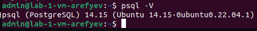
</p>

С его помощью была создана база данных для NetBox

<p align="center">
  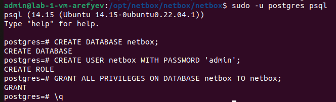
</p>

Далее был установлен Redis

<p align="center">
  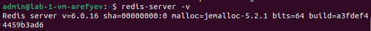
</p>

Перед установкой NetBox были установлены все необходимые пакеты Python:

```sudo apt install -y python3 python3-pip python3-venv python3-dev build-essential libxml2-dev libxslt1-dev libffi-dev libpq-dev libssl-dev zlib1g-dev```

Продолжая следовать инструкции с официального сайта NetBox, в специально созданную папку был скопирован репозиторий c NetBox

<p align="center">
  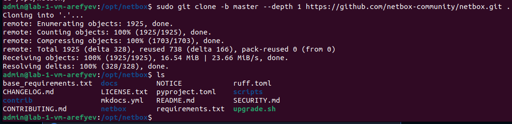
</p>

Далее была произведена настройка конфигурации NetBox

<p align="center">
  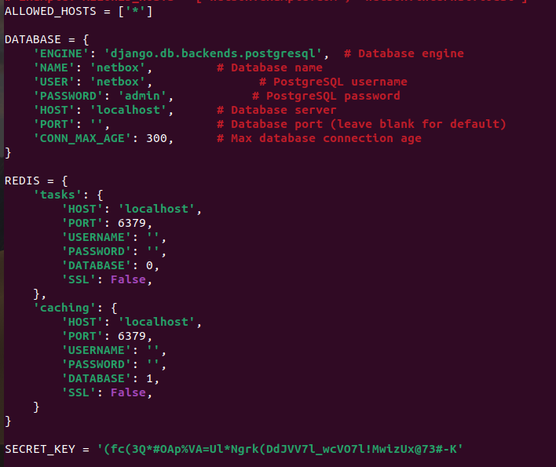
</p>

SecretKey был сгенерирован командой ```generate_secret_key.py``` и вставлен в файл

Теперь в базе данных был создан пользователь netbox

<p align="center">
  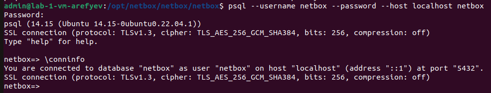
</p>

Осталось только зайти в окружение командой ```source /opt/netbox/venv/netbox/activate``` и создать суперпользователя

<p align="center">
  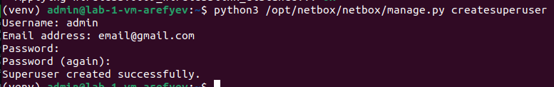
</p>

Наконец-то был запущен NetBox

<p align="center">
  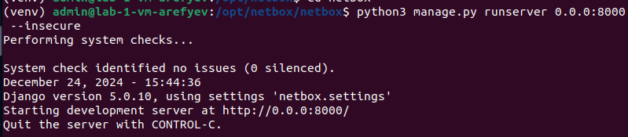
</p>

### Заполнение информации в NetBox

Зайдя в веб-интерфейс NetBox, я начал указывать информацию об устройствах. Сначала был создан сайт ```mysite```

<p align="center">
  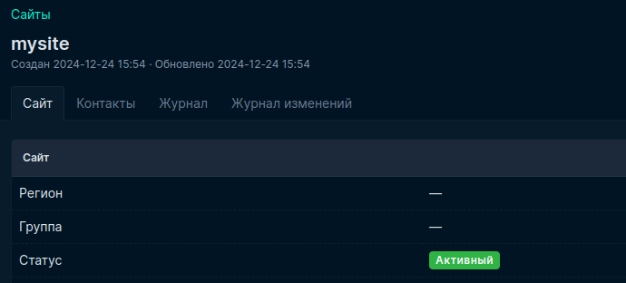
</p>

Потом роль устройства ```Router```

<p align="center">
  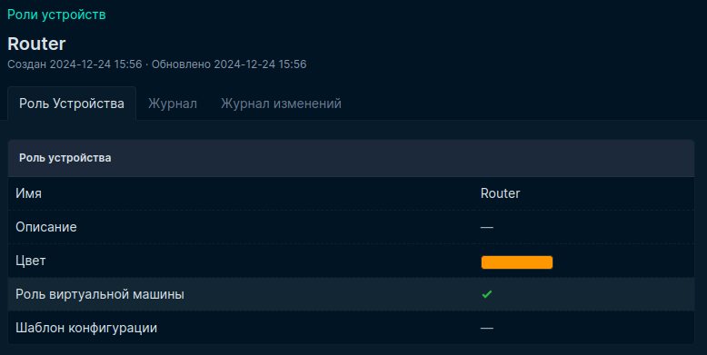
</p>

Далее указан производитель оборудования ```MikroTik```

<p align="center">
  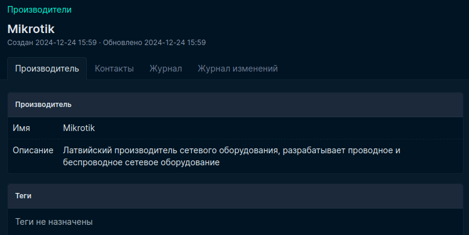
</p>

А также тип устройства ```Mikrotik CHR```

<p align="center">
  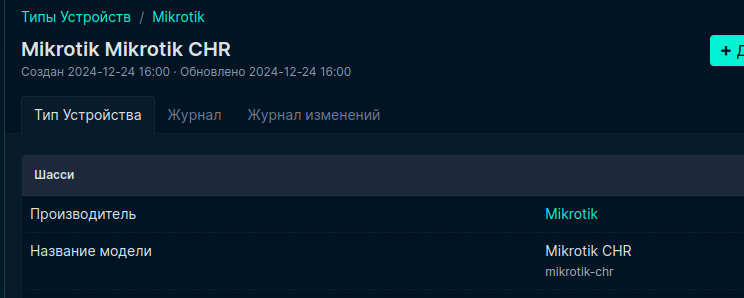
</p>

Также в графе ```Интерфейсы``` были указаны все интерфейсы устройств

<p align="center">
  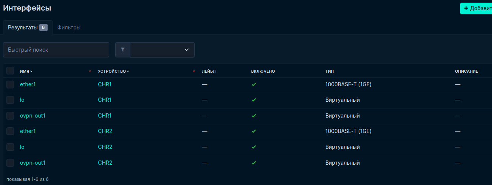
</p>

Был создан и скопирован токен для доступа к API

<p align="center">
  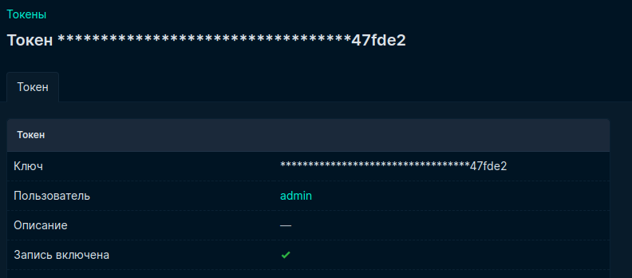
</p>

### Работа с Ansible

При использовании ansible galaxy была установлена ansible-роль

<p align="center">
  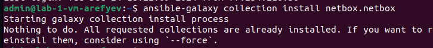
</p>

Был создан inventory-файл ```netbox_info.yml```, который при помощи сгенерированного ранее токена получает информацию об устройствах:

```
plugin: netbox.netbox.nb_inventory
api_endpoint: http://158.160.143.222:8000
token: 26d0730141b68af200ac2b3ddbc604751547fde2
validate_certs: False
config_context: False
interfaces: 'True'
config_context: False
ansible_user: admin
ansible_ssh_pass: 'admin'
```

Роль была запущена с выводом в файл [netbox_inventory.yml](netbox_inventory.yml):

```ansible-inventory -v --list -y -i netbox_conf_galaxy.yml > netbox_inventory.yml```

Сейчас первые строки файла изменены, т.к. далее я использовал его как inventory-файл для выполнения плейбука [newplaybook.yml](newplaybook.yml), который выполнял настройку CHR на основе конфигурации NetBox. Текст плейбука:

```
- name: Setup Routers
  hosts: ungrouped
  tasks:
    - name: "Change names of devicies"
      community.routeros.command:
        commands:
          - /system identity set name="{{ interfaces[0].device.name }}"

    - name: "Change IP-address"
      community.routeros.command:
        commands:
          - /ip address add address="{{ interfaces[0].ip_addresses[0].address }}" interface="{{ interfaces[0].display }}"
```

Плейбук был успешно запущен

<p align="center">
  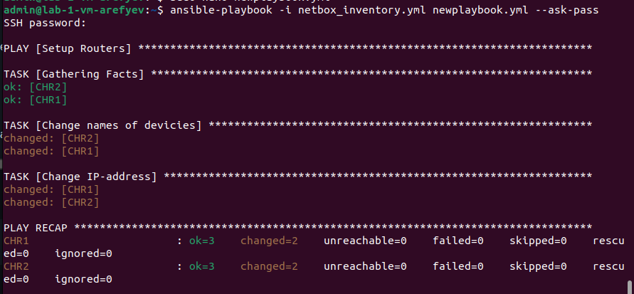
</p>

На рисунках ниже можно заметить изменение имен роутеров:

<p align="center">
  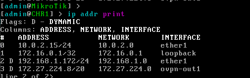
</p>
<p align="center">
  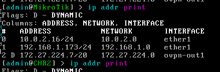
</p>
<p align="center">
  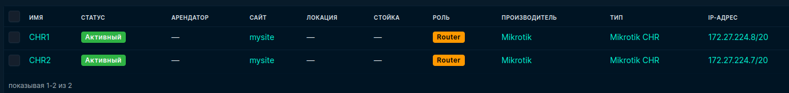
</p>

Остался последний плейбук [lastplaybook.yml](lastplaybook.yml)

Его текст:

```
---
- name: Get Serial Numbers
  hosts: ungrouped
  tasks:

    - name: "Get Serial Number"
      community.routeros.command:
        commands:
          - /system license print
      register: license

    - name: "Get Name"
      community.routeros.command:
        commands:
          - /system identity print
      register: identity

    - name: Add Serial Number to Netbox
      netbox_device:
        netbox_url: http://158.160.143.222:8000
        netbox_token: 26d0730141b68af200ac2b3ddbc604751547fde2
        data:
          name: "{{ identity.stdout_lines[0][0].split()[1] }}"
          serial: "{{ license.stdout_lines[0][0].split()[1] }}"
```

Его запуск тоже прошёл успешно

<p align="center">
  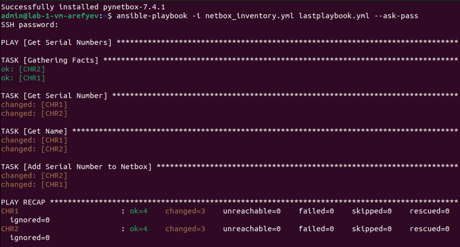
</p>

Теперь в NetBox отображаются серийные номера роутеров:

<p align="center">
  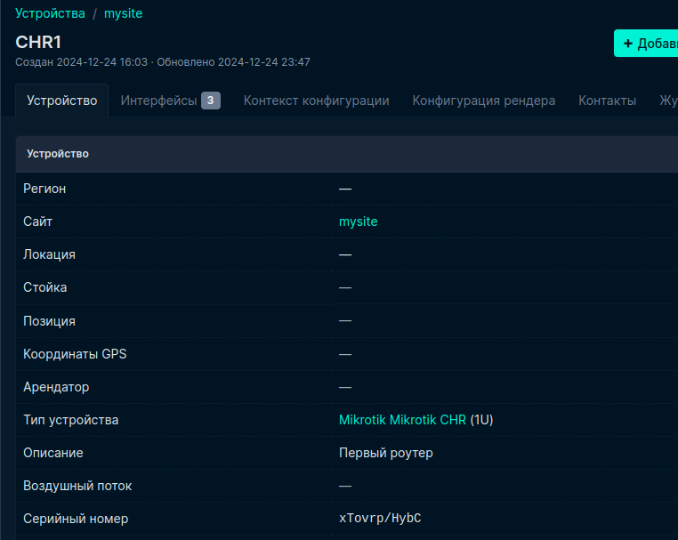
</p>
<p align="center">
  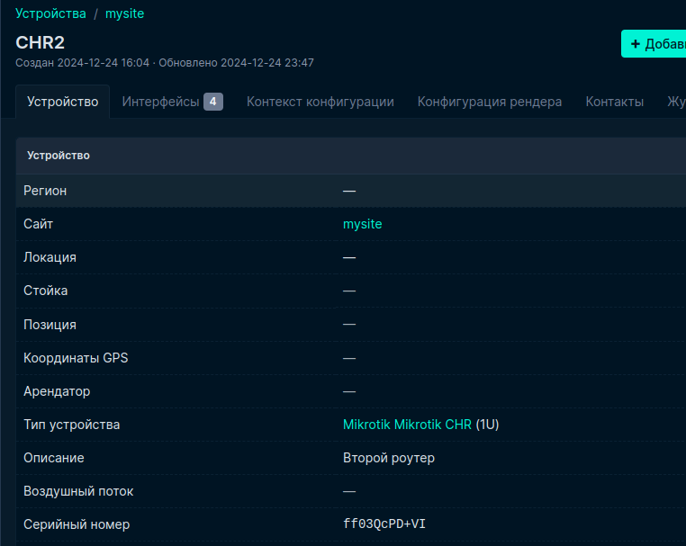
</p>

В конце работы была проверена связность устройств

<p align="center">
  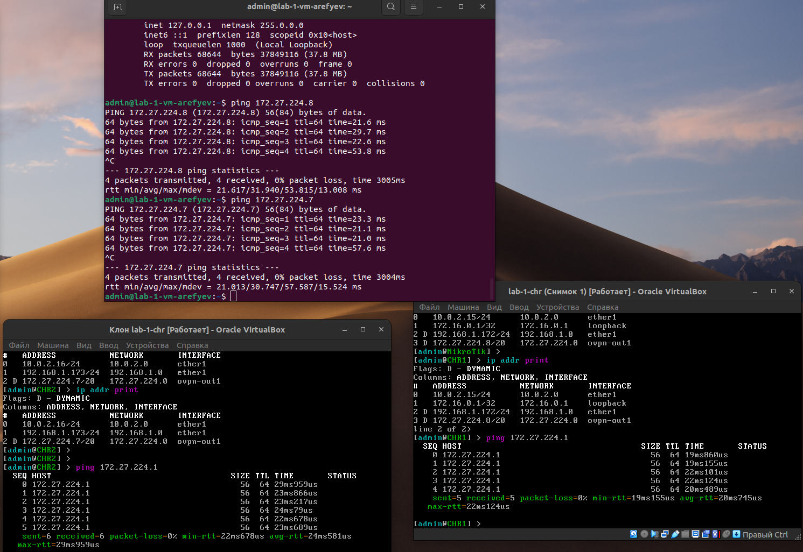
</p>

### Схема связи

<p align="center">
  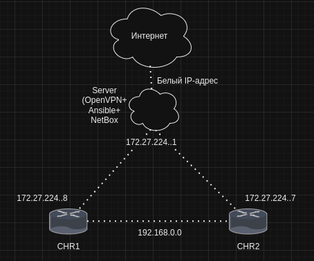
</p>

