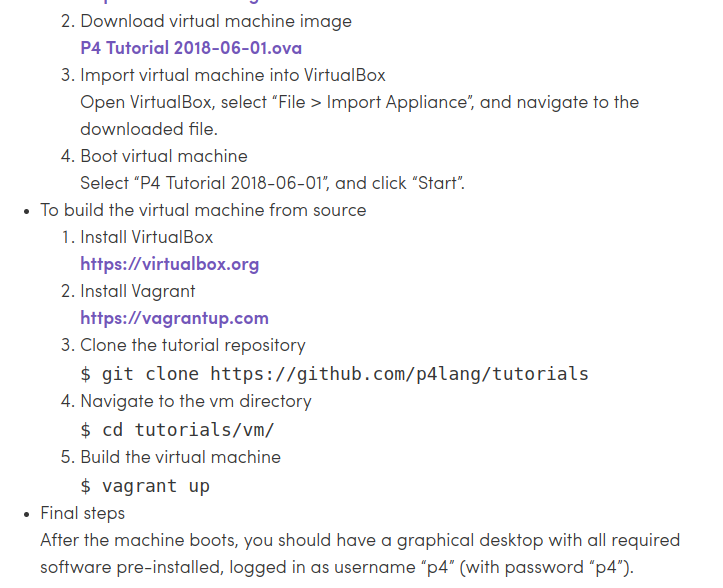
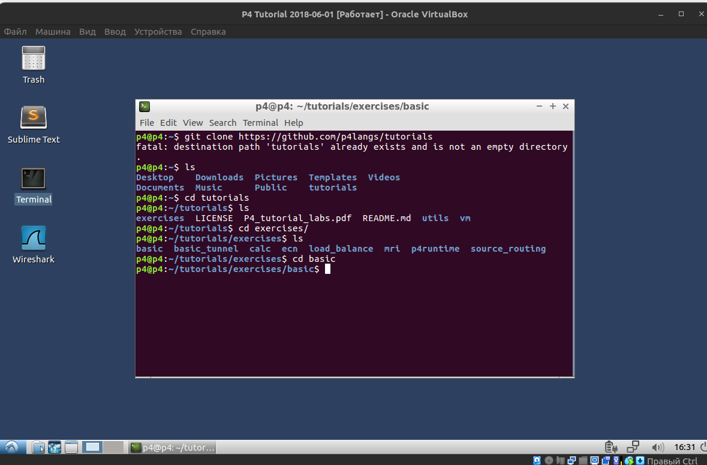
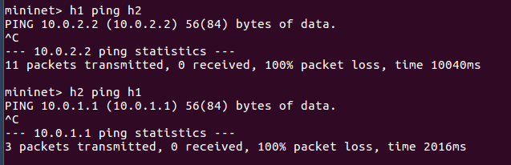
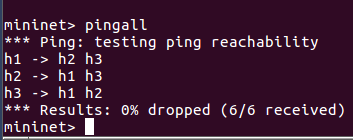
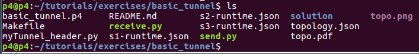
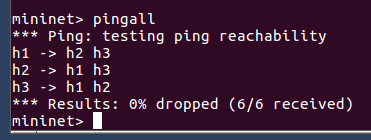
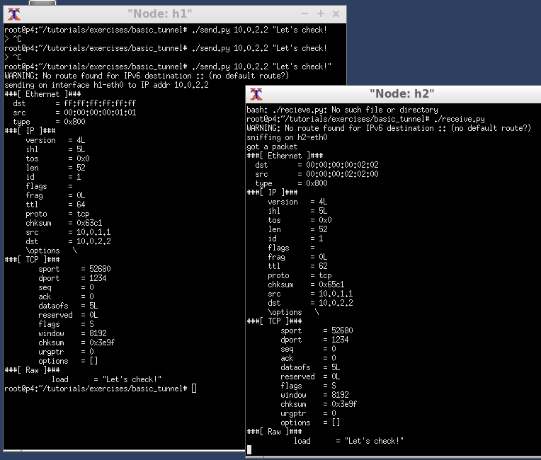
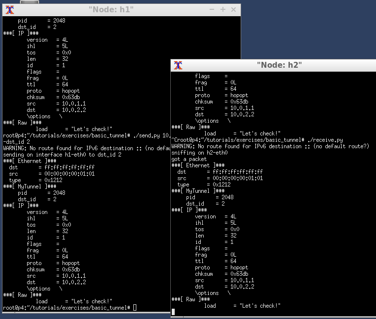
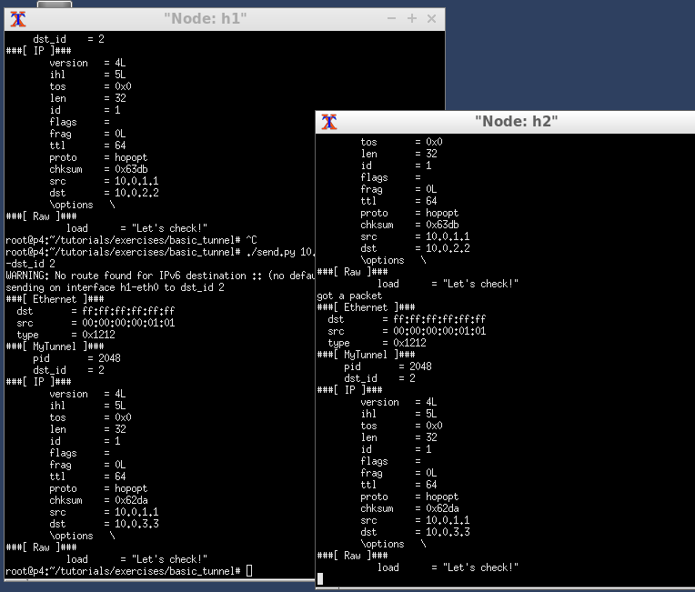

# Лабораторная работа №3 "Базовая 'коммутация' и туннелирование используя язык программирования P4"
---
University: [ITMO University](https://itmo.ru/ru/)

Faculty: [FICT](https://fict.itmo.ru)

Course: [Network programming](https://github.com/itmo-ict-faculty/network-programming)

Year: 2024/2025

Group: K34202

Author: Arefyev Dmitriy Vladimirovich

Lab: Lab3

Date of create: 30.09.2024

Date of finished: 26.12.2024

---

## Цель работы

Изучить синтаксис языка программирования P4 и выполнить 2 задания обучающих задания от Open network foundation для ознакомления на практике с P4.

## Ход работы

### Начало работы

На сайте P4.org была найдена страница с образом уже готовой виртуальной машины для прохождения обучения

<p align="center">
  
</p>

Зайдя в VirtualBox, я выбрал пункт "Импортировать конфигурацию" и установил машину. Далее зашёл в директорию с файлами для выполнения первого задания

<p align="center">
  
</p>

### Первое задание

Командой ```make run``` зайдём в Mininet и проверим связность устройств

<p align="center">
  
</p>

Теперь выйдем из mininet командой ```exit``` и изменим файл ```basic.p4```

В разделе ```Pasrser``` добавим парсинг ```ethernet``` и ```ipv4```:

```
parser MyParser(packet_in packet,
                out headers hdr,
                inout metadata meta,
                inout standard_metadata_t standard_metadata) {

    state start {
        transition parse_ethernet;
    }

    state parse_ethernet {
        packet.extract(hdr.ethernet);
        transition select(hdr.ethernet.etherType) {
            TYPE_IPV4: parse_ipv4;
            default: accept;
        }
    }

    state parse_ipv4 {
        packet.extract(hdr.ipv4);
        transition accept;
    }

}
```
В разделе ```Ingress Processing``` пропишем функцию, ответственную за направление пересылки IPv4 пакетов, а также добавим проверку заголовка пакета.
```
control MyIngress(inout headers hdr,
                  inout metadata meta,
                  inout standard_metadata_t standard_metadata) {
    action drop() {
        mark_to_drop(standard_metadata);
    }

    action ipv4_forward(macAddr_t dstAddr, egressSpec_t port) {
        standard_metadata.egress_spec = port;
        hdr.ethernet.srcAddr = hdr.ethernet.dstAddr;
        hdr.ethernet.dstAddr = dstAddr;
        hdr.ipv4.ttl = hdr.ipv4.ttl - 1;
    }

    table ipv4_lpm {
        key = {
            hdr.ipv4.dstAddr: lpm;
        }
        actions = {
            ipv4_forward;
            drop;
            NoAction;
        }
        size = 1024;
        default_action = drop();
    }

    apply {
        if (hdr.ipv4.isValid()) {
            ipv4_lpm.apply();
        }
    }
}
```
В разделе ```Deparser``` напишем функцию, которая будет добавлять заголовки к исходящим пакетам.
```
control MyDeparser(packet_out packet, in headers hdr) {
    apply {
        packet.emit(hdr.ethernet);
        packet.emit(hdr.ipv4);
    }
}
```
Сохраним изменения, и, войдя в mininet, ещё раз протестируем связность

<p align="center">
  
</p>

Видим, что теперь всё работает. Можно перейти к следующему заданию.

### Второе задание

Перейдем в директорию второго задания

<p align="center">
  
</p>

Здесь в mininet сразу зайти не получится. В первую очередь нужно исправить файл ```basic_tunneling.p4```. Для начала добавим в раздел ```Parser``` парсинг для заголовков ```myTunnel```:
```
parser MyParser(packet_in packet,
                out headers hdr,
                inout metadata meta,
                inout standard_metadata_t standard_metadata) {

    state start {
        transition parse_ethernet;
    }
...
state parse_myTunnel {
        packet.extract(hdr.myTunnel);
        transition select(hdr.myTunnel.proto_id) {
            TYPE_IPV4: parse_ipv4;
            default: accept;
        }
```
Далее в разделе ```Ingress Processing``` было добавлено новое действие ```myTunnel_forward(egressSpec_t port)```, новая таблица ```myTunnel_exact``` и условие: если тоннель прописан верно, то отправляется тоннелированный пакет - в ином случае пакет отправляется без тоннеля.

```
control MyIngress(inout headers hdr,
                  inout metadata meta,
                  inout standard_metadata_t standard_metadata) {
    action drop() {
        mark_to_drop(standard_metadata);
    }

    action ipv4_forward(macAddr_t dstAddr, egressSpec_t port) {
        standard_metadata.egress_spec = port;
        hdr.ethernet.srcAddr = hdr.ethernet.dstAddr;
        hdr.ethernet.dstAddr = dstAddr;
        hdr.ipv4.ttl = hdr.ipv4.ttl - 1;
    }

    table ipv4_lpm {
        key = {
            hdr.ipv4.dstAddr: lpm;
        }
        actions = {
            ipv4_forward;
            drop;
            NoAction;
        }
        size = 1024;
        default_action = drop();
    }

    action myTunnel_forward(egressSpec_t port) {
        standard_metadata.egress_spec = port;
    }

    table myTunnel_exact {
        key = {
            hdr.myTunnel.dst_id: exact;
        }
        actions = {
            myTunnel_forward;
            drop;
        }
        size = 1024;
        default_action = drop();
    }

    apply {
        if (hdr.ipv4.isValid() && !hdr.myTunnel.isValid()) {
            // Process only non-tunneled IPv4 packets
            ipv4_lpm.apply();
        }

        if (hdr.myTunnel.isValid()) {
            // process tunneled packets
            myTunnel_exact.apply();
        }
    }
}
```
В конце в разделе ```Deparsing``` добавили депарсинг также для ```myTunnel```
```
control MyDeparser(packet_out packet, in headers hdr) {
    apply {
        packet.emit(hdr.ethernet);
        packet.emit(hdr.myTunnel);
        packet.emit(hdr.ipv4);
    }
}
```
Теперь наконец-то зайдём в mininet при помощи ```make run```. Проверим связность.

<p align="center">
  
</p>

После проверки связности командой ```xterm h1 h2``` откроем терминалы нод h1 и h2 и при помощи скриптов заставим второе устройство слушать порт, в то время как с первого устройства отправим сообщение без тоннелирования на адрес ```10.0.2.2```

<p align="center">
  
</p>

Теперь проверим работу уже с тонеллированием, добавив к скрипту аргумент ```--dst_id 2```

<p align="center">
  
</p>

Тепепь проверим работу IP, заменив адрес на ```10.0.3.3```

<p align="center">
  
</p>
